# 🚀 Flask App CI/CD Pipeline using GitHub Actions, Docker, Trivy & EC2 Self-Hosted Runner


A complete end-to-end DevOps CI/CD project demonstrating automated Docker image building, security scanning, and deployment of a Flask application to an AWS EC2 Ubuntu server using GitHub Actions and a Self-Hosted Runner.

---

# 📌 Project Overview

This project implements a production-style CI/CD pipeline for a containerized Flask application.

The pipeline automatically:

* Builds a Docker image
* Pushes the image to DockerHub
* Performs vulnerability scanning using Trivy
* Uses Composite Actions and Reusable Workflows
* Deploys the latest image to an EC2 Ubuntu Self-Hosted Runner
* Replaces the old container with the new version
* Makes the Flask application available on the EC2 Public IP

---

# 🏗 Architecture

```text
Developer Push
        ↓
GitHub Actions (GitHub-hosted Runner)
        ↓
Reusable Workflow
        ↓
Composite Action
        ↓
Docker Build
        ↓
DockerHub Push
        ↓
Trivy Security Scan
        ↓
Self-Hosted Runner (EC2 Ubuntu)
        ↓
docker pull latest image
        ↓
stop old container
        ↓
remove old container
        ↓
run new container
        ↓
Flask Application Live on EC2 Public IP
```

---

# 🛠 Tech Stack

* Python Flask
* Docker
* DockerHub
* GitHub Actions
* Composite Actions
* Reusable Workflows
* Trivy Security Scanner
* AWS EC2 Ubuntu
* Self-Hosted GitHub Runner
* Linux
* Git & GitHub

---

# 📁 Project Structure

```text
flask-app-ecs
│
├── app.py
├── run.py
├── requirements.txt
├── Dockerfile
├── docker-compose.yml
│
└── .github
    ├── actions
    │   └── docker-build-push
    │       └── action.yml
    │
    └── workflows
        ├── docker-build.yml
        ├── reusable-docker-build.yml
        ├── caller-docker-build.yml
        └── deploy-ec2.yml
```

---

# ⚙️ CI Pipeline

### Stage 1 – Docker Build

* Checkout repository
* Build Docker image
* Validate Dockerfile and application packaging

### Stage 2 – DockerHub Push

* Login using GitHub Secrets
* Tag Docker image
* Push latest image to DockerHub

### Stage 3 – Build Artifact

* Generate build report
* Upload artifact to GitHub Actions

### Stage 4 – Composite Action

Created custom action:

```text
.github/actions/docker-build-push/action.yml
```

Encapsulated:

* Docker Build
* DockerHub Login
* Docker Push

### Stage 5 – Reusable Workflow

Created reusable workflow:

```text
reusable-docker-build.yml
```

Caller workflow invokes the reusable workflow and passes:

* Image Name
* DockerHub Username
* DockerHub Password

### Stage 6 – Trivy Security Scan

* Install Trivy
* Scan Docker image
* Generate vulnerability report
* Upload report as GitHub Artifact

---

# 🚀 CD Pipeline

Deployment runs on an AWS EC2 Ubuntu Self-Hosted Runner.

Deployment Steps:

```text
DockerHub Login
↓
Pull Latest Image
↓
Stop Existing Container
↓
Remove Existing Container
↓
Run New Container
↓
Verify Container Status
```

Deployment command:

```bash
docker pull <dockerhub-user>/flask-app-actions:latest

docker stop flask-app-gitactions || true
docker rm flask-app-gitactions || true

docker run -d \
  --name flask-app-gitactions \
  -p 80:80 \
  <dockerhub-user>/flask-app-gitactions:latest
```

---

# 🔐 GitHub Secrets Used

Repository → Settings → Secrets and Variables → Actions

```text
DOCKER_USER
DOCKER_PASSWORD
```

---

# ☁️ AWS Infrastructure

### EC2 Configuration

* Ubuntu Server 24.04 LTS
* Self-Hosted GitHub Runner
* Docker Engine Installed

### Security Group Rules

| Port | Purpose           |
| ---- | ----------------- |
| 22   | SSH               |
| 80   | Flask Application |

---

# 📷 Project Screenshots

## Repository Setup

### Project Files Verified

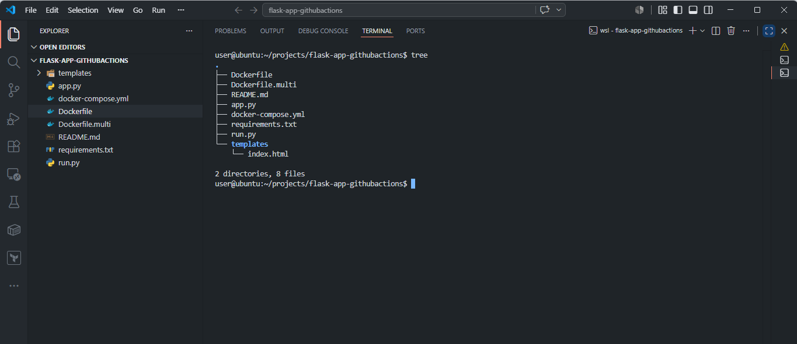

### Dockerfile Verified

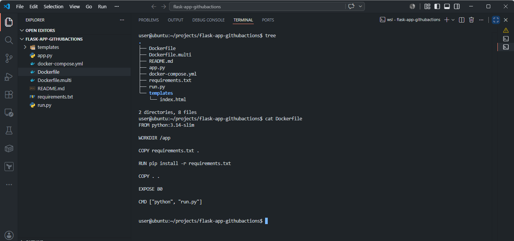

### Docker Build Workflow Created

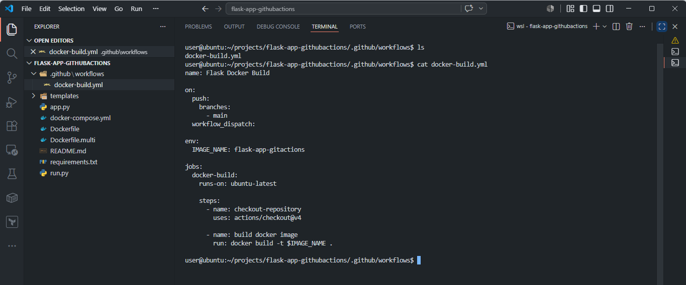

---

## Docker Build Pipeline

### Docker Build Success

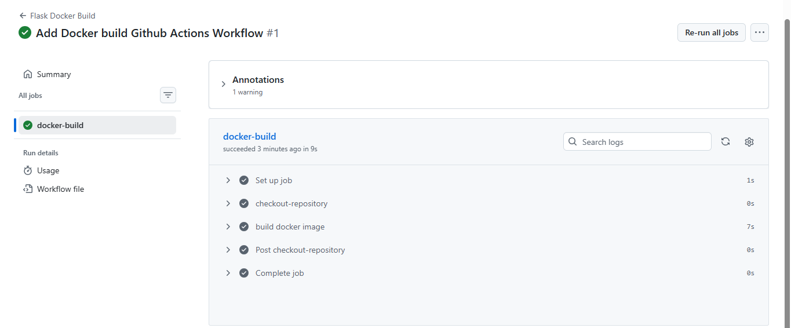

---

## DockerHub Integration

### DockerHub Push Success

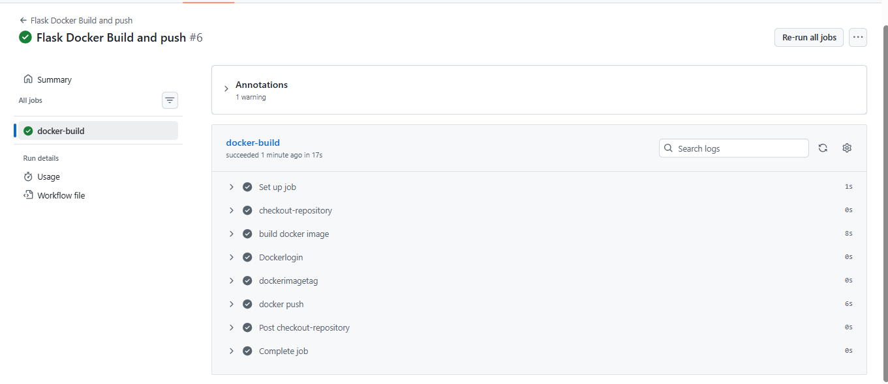

### Docker Image Uploaded to DockerHub

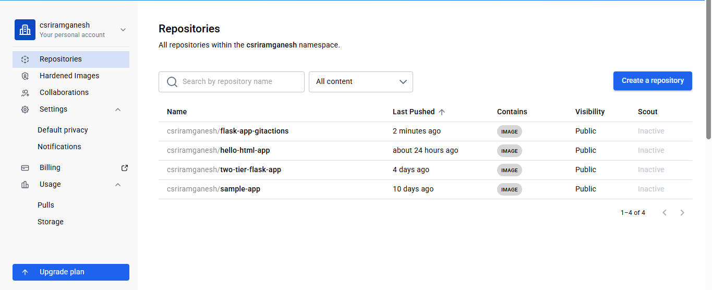

---

## Build Artifacts

### Build Artifact Uploaded

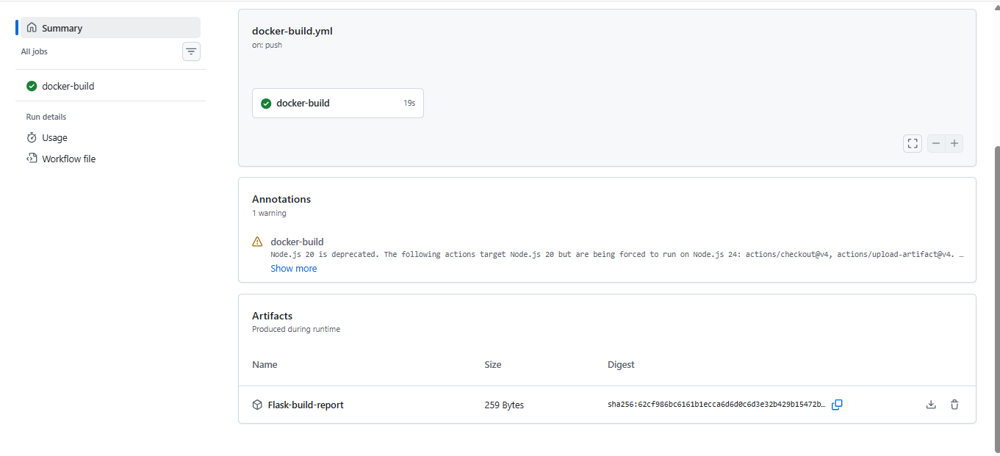

### Build Report Verified

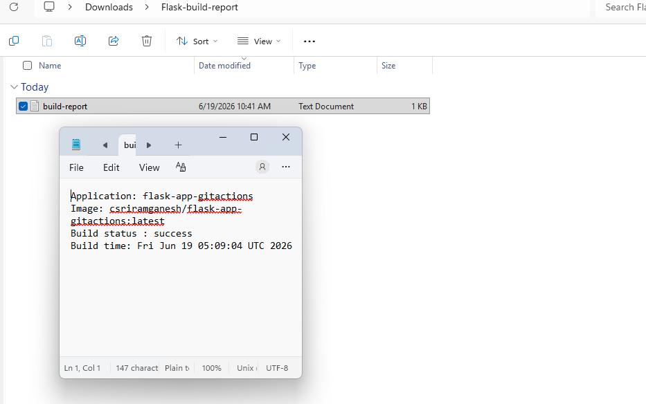

---

## Composite Actions

### Composite Action Created

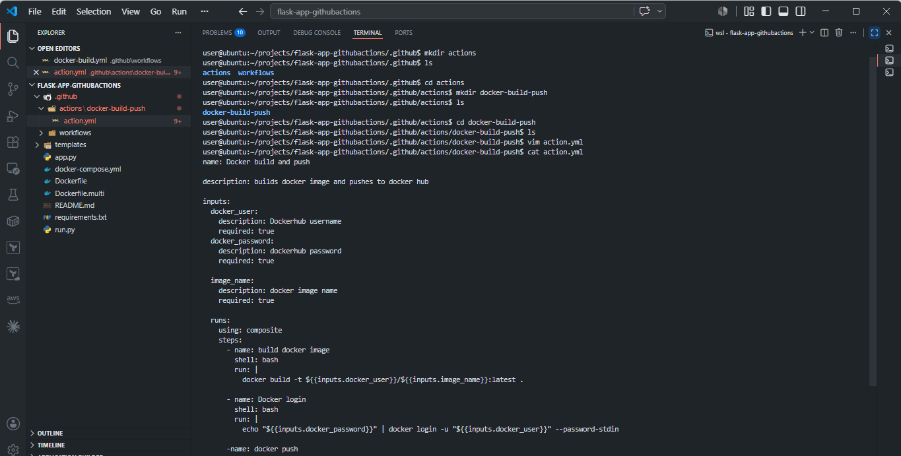

### Workflow Using Composite Action

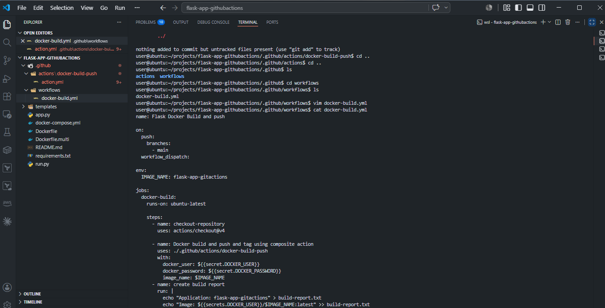

---

## Reusable Workflows

### Reusable Workflow Called Successfully

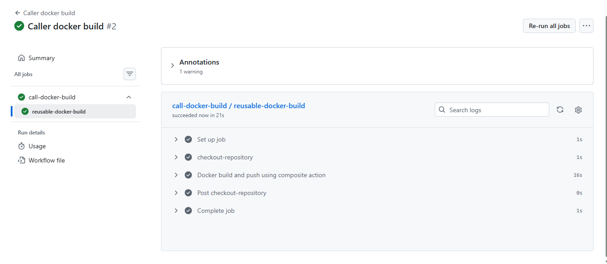

---

## Trivy Security Scanning

### Trivy Report Verified

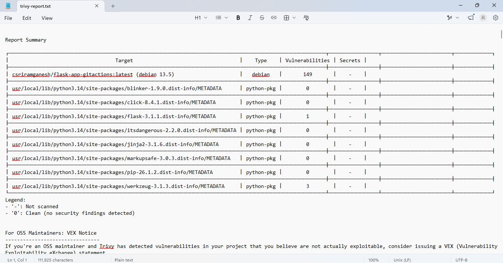

---

## EC2 Self-Hosted Runner

### GitHub Runner Online

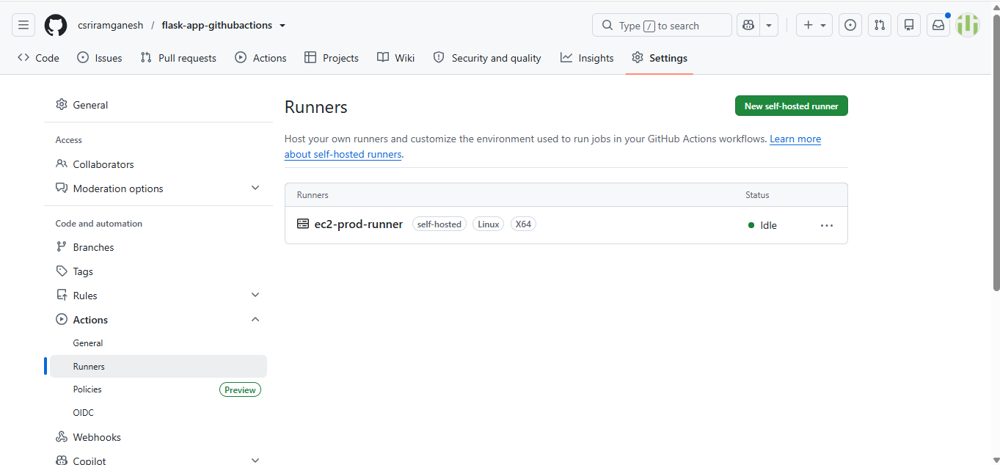

---

## Deployment

### Deployment Job Success

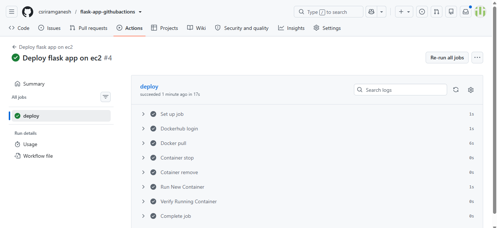

### Container Running on EC2

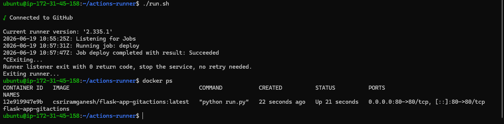

### Flask Application Live on EC2

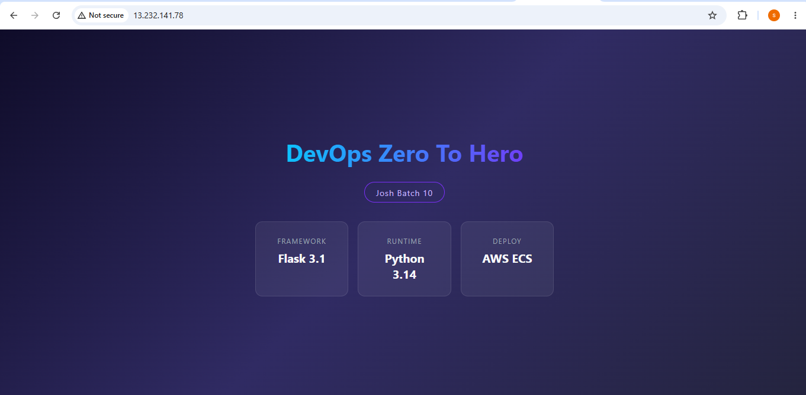

---

# 🎯 Key DevOps Concepts Demonstrated

✅ GitHub Actions CI/CD

✅ Docker Containerization

✅ DockerHub Registry Integration

✅ GitHub Secrets Management

✅ Build Artifacts

✅ Composite Actions

✅ Reusable Workflows

✅ Trivy Security Scanning

✅ AWS EC2 Self-Hosted Runner

✅ Automated Docker Deployment

✅ Zero Manual Deployment Process

---

# 🌐 Final Result

Every push to GitHub can automatically:

```text
Build Application
↓
Create Docker Image
↓
Push to DockerHub
↓
Scan for Vulnerabilities
↓
Deploy on EC2
↓
Replace Existing Container
↓
Serve Flask Application Live
```

This project demonstrates an end-to-end modern DevOps CI/CD implementation using GitHub Actions, Docker, Trivy, and AWS EC2 Self-Hosted Runners.

